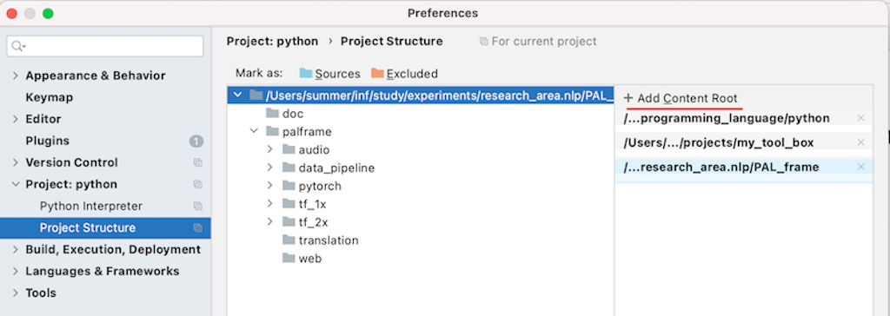
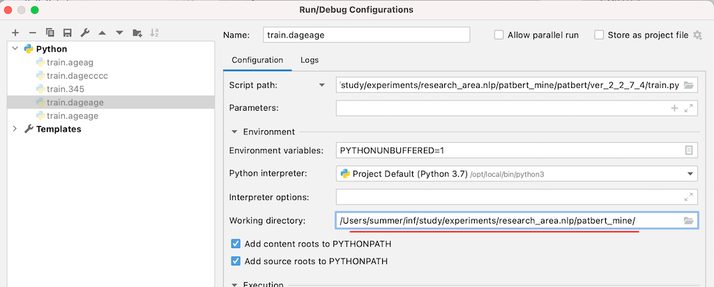

**PAL Frame** is the abbreviation of **Ping An Learning Framework**. Besides, 
**pal** also has a meaing of **friend** in English. Since this is the most
frequently used framework in the NLP group, it deserves to be called as
 our close friend. Thanks Chang Peng for coming up with such a wonderful name.

===============================================================================
# Version 5 What's New?

### 1. More safe
Before excuting GPU running, PAL Frame would examine the availability of desired
GPUs and accessibility of data folder. 

### 2. Supportive of more rich information returned in ```train_one_batch```.
Now the user defined function can return a ```dict```, 
```python
 return {
   "loss": loss,
   "batch_num": b_x.size(0), # depends on user's application.
   "figure": figure          # optional
 }
```
If your ```batch_num``` is just the number of sentences, then you could ignore
this value; otherwise, in some cases this number actually equating to word 
number, you have to set it exactly.

Espeically, the key ```figure``` records all information to draw by PAL Frame
automatically.

### 3. Automatic loss drawing in training
```python
figure = {
 "F1-score": 0.34,
 "accuracy": 0.46
}
```
as well as any information desired to show in a figure.
PAL Frame would append your training loss, as well as validation and testing 
data errors by default.

### 4. Rigid definition on model initialization

```python
class ModelWrapperBase:
 def __init__(self, param: ParamBase, user_model_cls):
  ...
  model = user_model_cls(param)
  ...
```

In comparison, lower versions permit passing a user model instance into 
`ModelWrapperBase`.


===============================================================================
# Version 4

## Section 1 - About PAL Frame

Since starting to develop 2 years ago, it has been evolved for 5 versions
, including one for tensorflow 1.X, one for tensorflow 2.X, three versions for
PyTorch. This README mainly introduce the most recent version, namely estimator4
, as it contains the richest functions among all versions.

#### 1. For managers, TLs, and team members 


We list only interfaces of main modules in estimator4, with their private 
functions omitted.

##### a) palframe.pytorch.estimator4.param.ParamBase 

```python

class ParamBase(abc.ABC):

  def __init__(self, run_tag: str, restore_training_from_path_work=None): 
    # Many default parameters are defined
    ...
    self.path_initial_model = None
    self.path_inference_model = None

    self.optimizer_name = "Adam"
    self.lr = 0.001
    self.weight_decay = 0
    self.param_norm = 1
    self.seed = 0     # 0 means random.

    self.servers_file = None  # for distributed training
    self.gpu_num = 1          # gpus required by your task
    self.use_gpu = True
    self.gpus = [0]           # do NOT set it, unless you use debug mode. 
    self.use_amp = True       # mixed precision based training

    self.batch_dim = 0

    self.iter_num_update_optimizer = 1  # gradient accumulation

    self.train_files = None     # file num >= 1
    self.vali_file = None       # file_num <= 1
    self.test_files = None      # file_num >= 0

    self.train_sample_num = None
    self.epoch_num = None       

    self.eval_gap_sample_num = None   # frequentcy to evaluate dev set.

    self.warmup_ratio = 0.1           # learning rate warm up.
    self.ending_lr_ratio = 0.001      # 1 means no lr decay

    self.model_saved_num = 3

    self.num_workers_loading_data = 4

    # None value denotes no limits on the maximum model size, or you should
    # set a value.
    self.automl_max_model_size = None

    self.true_gradient = False  # if data in each GPU is unbalenced.

    self.debug_level = 1        # debug=0, info=1, warning=2, error=3

    self.detect_anomaly = False # only for debugging.
```

##### b) palframe.pytorch.estimator4.model_wrapper.ModelWrapper
```python
class ModelWrapperBase:
  def __init__(self, param: ParamBase, model: torch.nn.Module):
    ...

  def evaluate_file(self, data_file) -> float:
    # return an evaluation result. Smaller, better.
    ...

  def predict(self, *batch):
    # Just invoke it
    return self._model(*batch)
    ...
```

##### c) palframe.pytorch.estimator4.train.TrainerBase
```python
class TrainerBase:
  def __init__(self,
               model_wrapper: ModelWrapperBase,
               train_data_iter,  
               optimizer: typing.Union[Optimizer, None, str]=None):
    ...

  def train_one_batch(self, *batch)-> tensor:
    # Given a batch=[batch_x, batch_y], return a loss tensor
    ...

  def early_stop(self, epoch_id, loss_history: list, vali_error_history: list):
    # override it when necessary
    return False  # default

  def train(self):
    # Just invoke it
    ...
```

##### d) palframe.pytorch.estimator4.predict.PredictorBase
```python

class PredictorBase:
  def __init__(self,
               model_wrapper: ModelWrapperBase):
    # You do NOT need to change it.

  def evaluate_file(self, data_file) -> float:
    # You do NOT need to change it.
    with torch.no_grad():
      return self._model_wrapper.evaluate_file(data_file)

  def predict(self, batch_data):
    # You do NOT need to change it.
    with torch.no_grad():
      return self._model_wrapper.predict(batch_data)
```

#### 2. AutoML 

Use `ParameterRange` to mark all parameters and set their candidate values, 
then PAL Frame would search all combinations for you in the backhand.

```python
    self.lr = ParameterRange([5e-4, 7e-4])
    self.warmup_ratio = ParameterRange([0.1, 0.2, 0.3])
    self.hidden_dim = ParameterRange([100, 200, 300])
```

#### 3. Automatic GPUs and servers allocation 
We assume a single task requires 2 GPUs, then we run it on my current server
and use GPU 2 and 3.

```python
param = MyParam.get_instance(),
param.gpu_num = 2    

starter.start_train(
  param,
  "nlp_tasks/task00_intent/ver_2_2_7_9/train.py",
  [starter.Server(None, [2, 3])]
)

```

Let continue with MyParam definition that uses **AutoML** and it finally
 generates
 `2x3x3=18` parameter variants. Then we have only one server with GPU 2, 3
available. Let's assume one task takes 1 hour, then we have to wait for 18
hours. The waiting looks boring ... 

Luckily, Shuang brother say, my task is done, and you can use GPU 0, 1 of that
server. We update our starting script like this.


```python
param = MyParam.get_instance(),
param.gpu_num = 2    

starter.start_train(
  param,
  "nlp_tasks/task00_intent/ver_2_2_7_9/train.py",
  [starter.Server(None, [0, 1, 2, 3])]
)

```
In this case, two tasks can be run in **parallel**. Hence, our waiting time is
 reduced to `18/(4/2)=9` hours. Life looks a bit better.
 
More luckily,  xiaozhao sister said, my task is also done, you can use RTX8000
 that has 8 GPUs. We further update our script like this, 


```python
param = MyParam.get_instance(),
param.gpu_num = 2    

starter.start_train(
  param,
  "nlp_tasks/task00_intent/ver_2_2_7_9/train.py",
  [starter.Server(None, [0, 1, 2, 3]),
   starter.Server("192.168.1.228", [0, 1, 2, 3, 4, 5, 6, 7])]
)
```
Then our waiting time becomes only `18/((4+8)/2)=3` hours.
Life should be much better.

#### 4. Built-in support for distributed training

**User**: How to update my codes to a distributed version? 

**PAL Frame**: Sir, you are all set. Try a different starting command.
    
```python
param = MyParam.get_instance(),
param.servers_file = "my_cluster_servers.txt"   # You tell PAL Frame this.
param.gpu_num = 8

starter.start_distributed_train(
  param,
  "patbert/ver_2_2_7_9/train.py",
)
```

## Section 2 - An step-by-step example 

#### Step 1. Configure your environment

##### Configure your PyCharam
Add PAL_Frame folder to your **Content Root**.



##### Set PYTHONPATH in Mac

If you run in your Mac terminal, then you need to add to `~/.profile`.
```
export PYTHONPATH={your-PAL-frame-folder}/PAL_frame:$PYTHONPATH
export PYTHONPATH=./:$PYTHONPATH
```  

Test the new settings
```
>> source ~/.profile
>> echo $PYTHONPATH
```
You should see the correct values.

##### Set PYTHONPATH in Linux

Add the above codes to `~/.bashrc`, and repeat the testing.
```
>> source ~/.bashrc
>> echo $PYTHONPATH
```

#### Step 2. Define param.py

```python
class Param(ParamBase):
  def __init__(self):
    super(Param, self).__init__("nlp_example.intent_dection")

    # standard parameters derived from ParamBase
    self.gpu_num = 2                    # required GPU number.
    self.use_gpu = False
    self.use_amp = False                # mixed precision based training
    self.optimizer_name = "Adam"
    self.lr = 5e-4
    self.batch_size = 16                # for one worker
    self.iter_num_update_optimizer = 1  # gradient accumulation
    self.warmup_ratio = 0.1             # lr warm percentage of all steps.
    self.model_kept_num = 5             # save you models
    self.path_feat = "feat/nlp/intent_dection"
    self.train_files = [f"{self.path_feat}/train.pkl"]
    self.vali_file = f"{self.path_feat}/vali.pkl"
    self.test_files = []
    self.train_sample_num = 100
    self.eval_gap_sample_num = 100      # sample number between two evaluations.
    self.epoch_num = 5

    # user model specific parameters 
    self.max_seq_len = 128
    self.class_number = 13
    self.embedding_size = 128
    self.kernel_sizes = [3, 4, 5]
    self.kernel_number = 128
    self.dropout_ratio = 0.3
    self.vocab_size = 60000
```
#### Step 3. Define model.py

```python
class Model(nn.Module):
  def __init__(self, param: Param):
    super(Model, self).__init__()

    self._embedding = nn.Embedding(param.vocab_size, param.embedding_size)

    self._textcnn = nlp_torch.TextCNN(
      kernels=param.kernel_sizes,
      in_channel=1,
      out_channel=param.kernel_number,
      max_seq_len=param.max_seq_len,
      dim=param.embedding_size,
      dropout=param.dropout_ratio
    )
    self._textcnn_output_size = len(param.kernel_sizes) * param.kernel_number

    self._dense = nlp_torch.Dense(
      nn.Linear(self._textcnn_output_size, param.class_number)
    )

  def forward(self, word_ids):
    word_ids = word_ids.unsqueeze(1)
    embedding_out = self._embedding(word_ids)
    textcnn_out = self._textcnn(embedding_out)
    out = self._dense(textcnn_out)
    pred_labels = torch.argmax(out, 1)

    return out, pred_labels
```

#### Step 4. Define model_wrapper.py

```python
class ModelWrapper(ModelWrapperBase):
  def __init__(self, param: Param):
    super(ModelWrapper, self).__init__(
      param, Model(param)
    )

  def evaluate_file(self, data_file: str):
    '''
    :param data_file:
    :return: smaller better, such as WER, -F1-value, -Accuracy.
    '''
    start_time = time.time()
    all_true_labels = []
    all_pred_labels = []
    for _, batch in get_batch_data(self._param, [data_file], 1, False):
      batch = [e.to(self._device) for e in batch]

      b_word_ids, b_labels = batch
      logits, pred_labels = self.predict(b_word_ids)

      all_true_labels.extend(b_labels.tolist())
      all_pred_labels.extend(pred_labels.tolist())

    result = Measure.calc_precision_recall_fvalue(
      all_true_labels, all_pred_labels
    )
    total_time = time.time() - start_time
    avg_time = total_time / (len(all_true_labels) + 1e-6)
    weighted_f = result["weighted_f"]
    Logger.info(
      f"eval: "
      f"file={data_file} weighted_f={weighted_f} result={result} "
      f"total_time={total_time:.4f} secs avg_time={avg_time:.4f} sec/sample "
    )
    Logger.info(f"WEIGHTED_F : {weighted_f}")

    return -weighted_f

  def predict(self, b_word_ids):
    logits, pred_labels = self._model(b_word_ids)
    return logits, pred_labels
```

#### Step 5. Define train.py
```python

class Trainer(TrainerBase):
  def __init__(self, param):

    super(Trainer, self).__init__(
      ModelWrapper(param),
      get_batch_data(param, param.train_files, param.epoch_num, True),
      None
    )

  def train_one_batch(self, b_word_ids, b_label):
    logits, pred_labels = self._model_wrapper.predict(b_word_ids)
    return nn.functional.cross_entropy(logits, b_label, reduction="mean")
```

#### Step 6. Run mode1: Debug Run
```
>> python3 example/nlp/intent_dection/train.py 
```
By design, quck run mode is for debugging, though you could run for simple tasks
which require only 1 GPU. If you use GPU in a server, you should make sure
param.gpus = [0] is available. 

This mode is not supportive of GPU allocation, server allocation, task
 parallelization. Strongly encourage you guys to use mode2, auto run.

#### Step 7. AutoML
```python
    # batch size does influence the final performance.
    self.iter_num_update_optimizer = ParameterRange([1, 2, 3]) 


    self.embedding_size = ParameterRange([128, 256, 512]) 
    self.kernel_sizes = ParameterRange([[3, 4, 5], [1, 2, 3, 4, 5], [5, 6, 7]])
    self.kernel_number = ParameterRange([128, 256]) 
    self.dropout_ratio = ParameterRange([0.1, 0.3])

    # even you could AutoML training data.
    self.train_files = ParameterRange(["train.1.pkl", "train.2.pkl"])
```

#### Step 8. Run mode2: Auto Run - for AutoML or batch tasks 
By convention, we write a train_starter.py
```python
  starter.start_train(
    Param.get_instance(), 
    "example/nlp/intent_dection/train.py",
    [starter.Server(None, [1, 3, 4, 6, 7])]
  )
```

#### Step 9. Run mode3: Dist Run - for large training
Set your server_file in your param.py, and use a different starting function
```
  starter.start_distributed_train(
    Param.get_instance(),
    "example/nlp/intent_dection/train.py",
  )

```

#### Step 10. Read your log 
Run.
```
>> nohup python3 example/nlp/intent_dection/train_starter.py > log.any_name &
```
In current folder, `log.any_name` only tell you if your running is normal. You
should check `work/{run_dir}/log/log.rank_0` to read outputs of your model.
 `{run_dir}` can be found in `log.any_name`.

When your running fails, you can check `work/{run_dir}/log/log.node_0`, and
the problematic batch data and model are automatically saved into `work/{run_dir
}/bug/` for your bug replay. 

#### Step 11. Stop a training 
There is a **unique** method to stop your training, regardless of any 
 starting mode.
```
python3 palframe/pytorch/estimator4/stopper.py {ParamBase.path_work}
``` 

#### Step 12. More advanced usage 
You could have **different models** run together in a server pool to use your
 resources to an extreme.
Use `RunManager` class.
```python
  run_manager = RunManager(tasks, servers)
  run_manager.run()
```
See definition of `Task` and `Server` in `palframe/pytorch/estimator4/starter.py`.
```
class Server:
  def __init__(self, ip, gpus):
    ...

class Task:
  def __init__(self, param: ParamBase, source_script_and_params):
    ...
```

In the PAT-BERT project, one pretrained model would be tested in 10 downstream
 NLP tasks, and each task has multiple set of parameter configurations. 
 We typically use `RunManager` to finish 216 tasks in 180 GPUs in just 16 hours. 

#### Step 13. Full operations for the above NLP example
```
>> python3 example/nlp/intent_dection/make_features.py 
>> nohup python3 example/nlp/intent_dection/train_starter.py > log.any_name &
```

## Section 3. Miscellaneous functions

#### 1. Single-node multi-GPU support
#### 2. Distributed training
#### 3. Automaic GPUs and servers allocation for task parallelization
#### 4. AutoML
#### 5. Three running modes 

No any change for your codes.
1. `Debug mode`, for debugging only, which uses single GPU (or CPU).
2. `Auto mode`, your common choice, which supports automatic GPUs and servers allocation.
3. `Distributed mode`, for quite complex tasks that need more than one server.

#### 6. Learning rate warmup and decay

#### 7. Training restoration after server is down

So far we only support Debug mode, Distributed mode, and a single task in Auto 
mode. Todo: to support Auto mode fully.

In the ___construction function___ of the user's Parameter class, set the `restore_training_from_path_work` as the running path of your last run. Its default
value is `None`.

#### 8. Early stop

#### 9. Mixed precision training
Capable of speeding up training by 80% without a performance degradation.

#### 10. Four predefined datasets for small and large data loading
Effectively support extremely large dataset.

#### 11. Gradient accumulation
In the case when Distributed mode is unavailable.

#### 12 Dev set evaluation
The best evaluation score and its corresponding model are showed and stored.

#### 13. TensorBoard
```
>> tensorboard --logdir work/{run-log}/tensorboard --bind_all
```

#### 14. True gradient 
If your GPUs have unbalanced running tasks, such as different batch sizes, you 
could active this function to improve your final performance. 
Besides setting `param.true_gradient = True`, 
in `train_one_batch`, you should return `(loss, batch num)`, instead of just
`loss`.

#### 15. Rich information in log file 

1. You model trainable parameter information

    Besides total number of parameters are displayed, parameters are
 sorted by their sizees, percentage on overall parameters.

1. Training time prediction 

1. Network efficiency estimate

#### 16. Deployment
A default PredictorBase is provided and we have preset some enviroment for you, such as
set inference and no gradient.

Each deployment supports only GPU and is defined as param.gpus[0]. 
Thus, you should set proper param.gpus values. 
    
## Section 4. Config your linux server 

#### Remove password in login
```
1. >> ssh-keygen -t rsa
    生成的过程中提示输入，直接回车，接受默认值就行了。
    其中公共密钥保存在 ~/.ssh/id_rsa.pub， 私有密钥保存在 ~/.ssh/id_rsa
2. 然后改一下 .ssh 目录的权限，使用命令 "chmod 755 ~/.ssh"
3. 之后把这个密钥对中的公共密钥复制到你要访问的机器上去，并保存为~/.ssh/authorized_keys.
4. 设置权限: chmod 644 ~/.ssh/authorized_keys
```

#### Permit net ports 

#### Share your data disk to other servers
```
>> sshfs {user}@{ip}:{data-folder} {local-folder} -o idmap=user -o allow_other
```

#### Install required python packages
```
>> python3 -m pip install -r requirements.txt  --user `whoami` 
```


## Section 5. Common errors 
**E1**. Not running in your **working directory**.

The **working directory** is an essential concept in our framework, so is 
the same in Java. When your project has many self-defined modules, do **NOT**
run them in the deepest folder, but in this **working directory**. 



**E2**. GPU is not available.
PAL Frame detects your designated GPUs are unvailable, and refuse to run.

**E3**. Data path is not available. 
PAL Frame detects your designated `data path` are unvailable from servers to
 run, and refuse to run.

**E4**. Can not automatically set `ParamBase.net_name`.

In the most cases, PAL Frame would set this for you. Yet in some very 
rare case, PAL Frame can not set a correct value. One workable 
solution is `ls /sys/class/net)` to try those value one by one.
A typical `net_name` is `en0`, `eth0`.

## Section 6. Useful functions in PAL Frame
1. from palframe.measure import Measure

## Section 7. Popular Questions 

**Q1.** As I do not need distributed training in foreseeable future, do I need
 PAL Frame?

There are looots of functionalities besides the distributed training.
 
**Q2.** Is **debugging** in PAL Frame different from others?

Nooo any difference. In the debugging mode, PAL Frame would set your
program to using only ONE worker as well as one thread in the background.

**Q3.** Who should I contact when encountering an error?

**Q4.** If, in training, your evaluation on dev and testing datasets takes more than 30 minutes, the training would halt.

This is because the training is distributed while the evaluation is running on GPU (rank_0), and other GPUs are still waiting for the evaluation to be done. If the evaluation takes more than the default maximum 30 minutes, the pytorch distribution system thinks there may have some exception occured and halts.

You may ask why you donot set the evaluation in a distributed style too. I tried and did not find **an elegant design pattern**, though I can **techinically** solve this issue that users would have more burden to use PAL Frame.

One short-cut of this issue is, sample a moderate-size data from your true dev data and use as dev in training; after training is finished, test the whole true dev data in one time.

**Q5.** In order to speedup the data loading, could I copy the training data to a local path in each server, and how to set PAL Frame?

Sure. You can do it, and it indeed speedups the data loading as well as the training. There are two ways to do it.

First, copy ALL data to each server. Then, you do not need to change any code. It runs perfectly.

Second, copy `1/n` data to `n` servers respectively to save disk space. Then in the user's train.py, you need to update the parameters of get_batch_data(...) in ```Trainer.__init__(...)```. Change ```dist.get_rank()``` and ```dist.get_world_size()``` to ```dist.get_local_rank()``` and ```self._param.gpu_num```.

